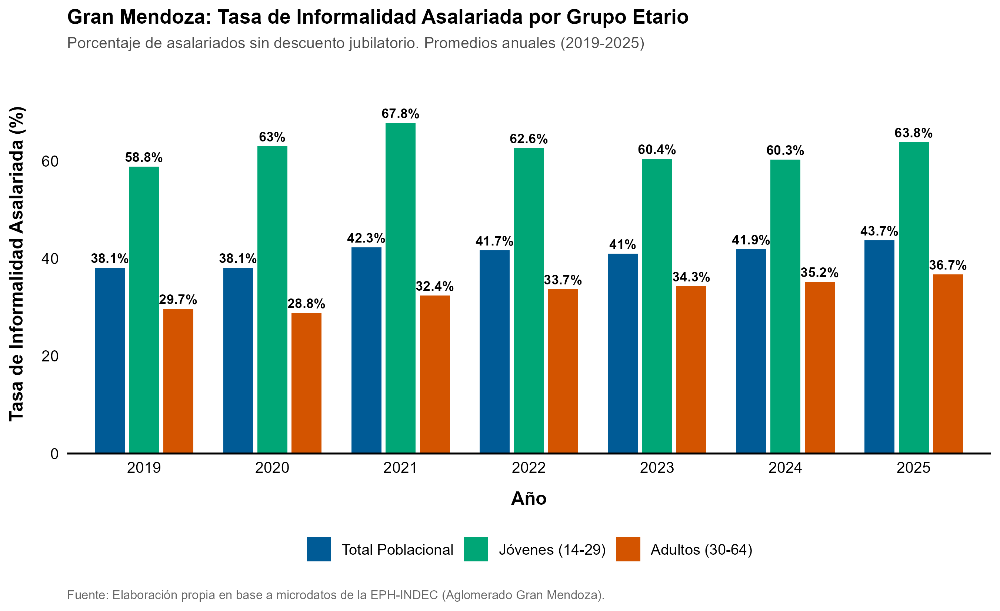
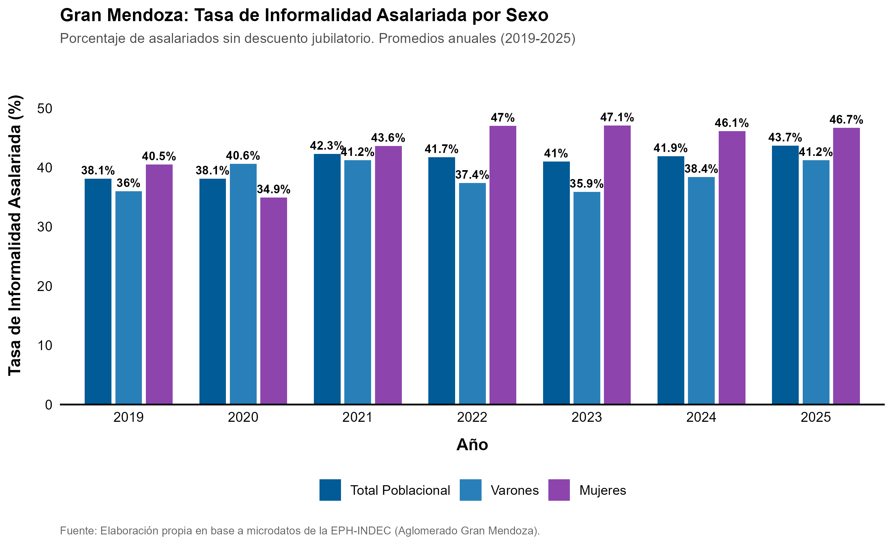

```{r setup, include=FALSE}
knitr::opts_chunk$set(
  echo = TRUE,
  warning = FALSE,
  message = FALSE,
  fig.align = "center",
  out.width = "90%"
)
library(tidyverse)
library(knitr)
```

# 1. Introducción

Para realizar el trabajo final del Curso Programación y visualización en estadísticas laborales (ASET) se eligió como fuente de datos la Encuesta Permanente de Hogares (EPH-INDEC). Dado que era mi interés dejar de usar SPSS para procesar tasas básicas del mercado de trabajo de jóvenes en el Gran Mendoza, me enfoqué en convertir esa sintaxis que usé por mucho tiempo a R. Por ello, el script presentado incluye el procesamiento de las tasas de actividad, empleo, desocupación y asalarización; además de la variable dummy de precariedad solicitada en las consignas. Sin embargo, en este informe se incluyen solo los datos requeridos. 

En este marco, el presente informe analiza la evolución de la informalidad laboral de asalariados/as en el aglomerado Gran Mendoza durante el período 2019-2025, trabajando las bases de manera anualizada. Se examina la incidencia de la informalidad en la población asalariada, con foco en las diferencias entre grupos etarios (jóvenes de 14 a 29 años vs. adultos/as de 30 a 64 años) y según sexo (varones vs. mujeres).

# 2. Cobertura y Descripción de la Muestra (EPH)

El procesamiento abarcó un total de **28 bases trimestrales de la EPH-INDEC** correspondientes al período **2019-2025**. La muestra se delimitó a la población en edad de trabajar (14 a 64 años) residente en el Aglomerado **Gran Mendoza**.

A los fines de garantizar la representatividad de los datos, el análisis exploratorio de la muestra se organiza en tres dimensiones fundamentales: el total poblacional, la desagregación por grupos etarios y la distribución según sexo.

---

## 2.1. Cobertura muestral total

La Tabla 1a resume la evolución de los casos muestrales efectivamente encuestados, la población expandida mediante el factor de ponderación (`PONDERA`) y el volumen de la submuestra de asalariados/as sobre la cual recae el indicador de informalidad.

```{r tabla_total, echo=FALSE}
conteo <- read_csv("resultados/01_conteo_casos_muestra.csv", show_col_types = FALSE)

conteo %>%
  filter(cobertura == "Gran Mendoza") %>%
  filter(grupo_etario == "Total" | is.na(grupo_etario) | grupo_etario == "") %>%
  select(ANO4, casos_muestrales, poblacion_expandida, asalariados_muestra) %>%
  kable(
    col.names = c("Año", "Casos Muestra", "Población Expandida", "Submuestra Asalariados/as"),
    format.args = list(big.mark = "."),
    caption = "Tabla 1a: Cobertura muestral total y población expandida en Gran Mendoza (EPH 2019-2025)"
  )
```

La EPH mantiene una elevada consistencia en la captura de datos en Gran Mendoza, registrando un promedio anual cercano a los 5.400 casos muestrales (acumulados a lo largo de las 4 ondas trimestrales de cada año). Al aplicar los factores de ponderación, la muestra expandida proyecta una población en edad de trabajar que evoluciona desde aproximadamente 680.000 a 720.000 personas entre 2019 y 2025.

Por último, el subconjunto de ocupados/as asalariados/as comprende un volumen anual de entre 1.800 y 2.200 observaciones reales, lo que posibilita la estimación de la tasa de informalidad laboral.

---

## 2.2. Descripción de la Muestra por Grupo Etario

Para comparar las condiciones de inserción laboral entre la juventud y la población adulta, la muestra se subdividió en dos tramos etarios: jóvenes (14 a 29 años) y adultos/as (30 a 64 años), siguiendo los valores usados en los tabulados de los informes trimestrales de la EPH.

```{r tabla_etario, echo=FALSE}
conteo %>%
  filter(cobertura == "Gran Mendoza") %>%
  filter(!is.na(grupo_etario) & grupo_etario != "" & grupo_etario != "Total") %>%
  mutate(grupo_etario_norm = case_when(
    grepl("Jóven|14|29", grupo_etario, ignore.case = TRUE) ~ "Jóvenes (14 a 29 años)",
    grepl("Adult|30|64", grupo_etario, ignore.case = TRUE) ~ "Adultos (30 a 64 años)",
    TRUE ~ as.character(grupo_etario)
  )) %>%
  group_by(ANO4, grupo_etario = grupo_etario_norm) %>%
  summarise(
    casos_muestrales = sum(casos_muestrales, na.rm = TRUE),
    poblacion_expandida = sum(poblacion_expandida, na.rm = TRUE),
    asalariados_muestra = sum(asalariados_muestra, na.rm = TRUE),
    .groups = "drop"
  ) %>%
  arrange(ANO4, grupo_etario) %>%
  kable(
    col.names = c("Año", "Grupo Etario", "Casos Muestra", "Población Expandida", "Submuestra Asalariados/as"),
    format.args = list(big.mark = "."),
    caption = "Tabla 1b: Casos muestrales y población expandida por grupo etario en Gran Mendoza (EPH 2019-2025)"
  )
```

**Estructura demográfica de la muestra:** El segmento adulto (30 a 64 años) comprende aproximadamente el 60-65% del total de la muestra, reflejando la amplitud de un tramo que abarca 35 años de cohorte, frente al tramo joven (16 años de cohorte), que representa entre el 35-40%.

**Composición de la submuestra asalariada:** En la población asalariada, la brecha de volumen se acentúa: los adultos/as representan alrededor de 1.400 a 1.600 casos anuales, mientras que las personas jóvenes rondan los 500 a 650 casos. Esta diferencia no es solo demográfica, sino que también deja ver las menores tasas de actividad y ocupación de la juventud. A pesar de ser un grupo reducido, la submuestra juvenil mantiene más de 500 observaciones anuales en Gran Mendoza, garantizando un margen de error bajo para la medición de la tasa de precariedad.

---

## 2.3. Descripción de la Muestra por Sexo

Finalmente, la muestra fue analizada según la variable de sexo registrado por la encuesta (varones y mujeres) para evaluar la representación muestral y en la submuestra bajo estudio.

```{r tabla_sexo, echo=FALSE}
conteo %>%
  filter(cobertura == "Gran Mendoza") %>%
  filter(!is.na(sexo) & sexo != "" & sexo != "Total") %>%
  mutate(sexo_norm = case_when(
    grepl("Var|Hom", sexo, ignore.case = TRUE) ~ "Varones",
    grepl("Muj", sexo, ignore.case = TRUE) ~ "Mujeres",
    TRUE ~ as.character(sexo)
  )) %>%
  group_by(ANO4, sexo = sexo_norm) %>%
  summarise(
    casos_muestrales = sum(casos_muestrales, na.rm = TRUE),
    poblacion_expandida = sum(poblacion_expandida, na.rm = TRUE),
    asalariados_muestra = sum(asalariados_muestra, na.rm = TRUE),
    .groups = "drop"
  ) %>%
  arrange(ANO4, sexo) %>%
  kable(
    col.names = c("Año", "Sexo", "Casos Muestra", "Población Expandida", "Submuestra Asalariados/as"),
    format.args = list(big.mark = "."),
    caption = "Tabla 1c: Casos muestrales y población expandida por sexo en Gran Mendoza (EPH 2019-2025)"
  )
```

**Paridad muestral en la población total:** La encuesta refleja una distribución equilibrada entre varones y mujeres en el Gran Mendoza, con una leve predominancia de las mujeres en la población expandida (cercana al 52%), consistente con la estructura demográfica urbana general.

**Composición de la submuestra asalariada:** Al examinar la submuestra efectiva de asalariados/as, los varones muestran un volumen muestral ligeramente superior (entre 1.000 y 1.150 casos anuales) respecto a las mujeres (entre 900 y 1.050 casos). Esta brecha responde a las mayores tasas de asalarización y formalidad masculinas y a la menor tasa de asalarización formal de las mujeres, condicionada por la "segregación horizontal".

# 3. Variable dummy empleo precario - definición operativa

Para medir la precariedad laboral en el mercado de trabajo se construyó una variable binaria/dummy (`informal_dummy`) aplicada **exclusivamente sobre la población ocupada asalariada** (`ESTADO == 1 & CAT_OCUP == 3`):

* **Informal / Precarizado (`informal_dummy = 1`):** Asalariados/as a quienes **no se les realiza descuento jubilatorio** (`PP07H == 2`).
* **Formal / Registrado (`informal_dummy = 0`):** Asalariados/as a quienes **sí se les realiza descuento jubilatorio** (`PP07H == 1`).

> **Población bajo análisis:** La tasa de informalidad asalariada expresa el porcentaje de trabajadores sin descuento jubilatorio sobre el total de asalariados/as. No se calcula sobre el total de ocupados/as ni sobre la población total, dado que el descuento jubilatorio es una institución propia de la relación salarial.

# 4. Incidencia de la Informalidad asalariada en el Gran Mendoza

A pesar de las fluctuaciones en las tasas generales de actividad y ocupación a lo largo de la serie 2019-2025, la informalidad laboral muestra un comportamiento estructural profundamente desigual cuando se la desagrega por edad y sexo.

## 4.1. Análisis por Grupo etario (jóvenes vs. adultos/as)

La inserción laboral de las personas jóvenes (14 a 29 años) en el Gran Mendoza se caracteriza por un sesgo sistemático hacia la precariedad:

```{r grafico_edad, echo=FALSE}

```

En todo el período analizado, la tasa de informalidad en jóvenes duplica holgadamente la registrada en el segmento adulto (30 a 64 años), tratándose así de una brecha estructural en términos de la calidad del empleo. Mientras que en los adultos la informalidad asalariada oscila en torno al **30-35%**, en la juventud supera holgadamente el **60%**, evidenciando barreras de entrada al empleo asalariado registrado.

## 4.2. Análisis por sexo (varones vs. mujeres)

Al ver la calidad del empleo asalariado según sexo, se observan matices significativos en el comportamiento de la brecha de género:

```{r grafico_sexo, echo=FALSE}

```

Si bien la informalidad asalariada afecta a ambos sexos con niveles elevados (entre el **38% y 45%** del total asalariado), las fluctuaciones coyunturales muestran que las mujeres asalariadas suelen experimentar mayor vulnerabilidad en momentos de contracción económica, asociadas a la inserción en sectores altamente precarizados (como el servicio doméstico y el comercio minorista).


